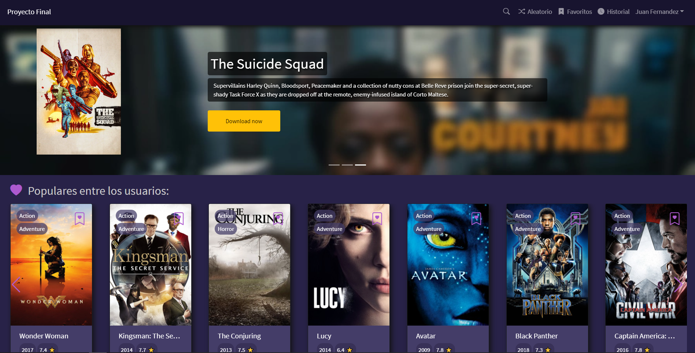

# Movie Webpage

I created this simple movie webpage as a final project for ComunidadIT full-stack web developing course. 

# Description

I used :

### YTS API 

For movie links and information

[YTS API](https://yts.mx/api)

### Swiper JS

For swipers in main page 

[Swiper JS](https://swiperjs.com/)

